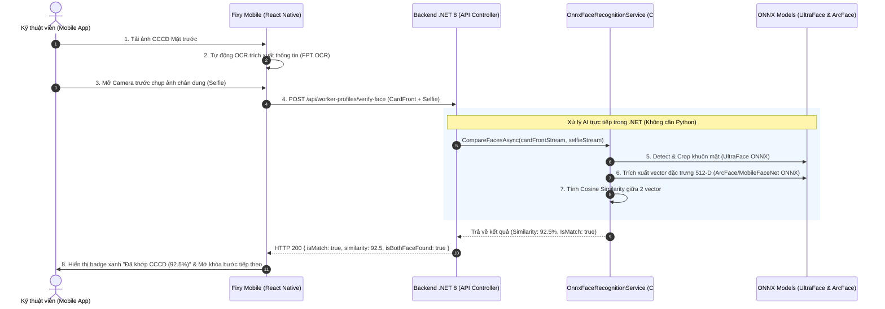

# Kế hoạch triển khai: Nhúng ONNX AI Face Recognition vào .NET & Tích hợp Mobile

Tài liệu thiết kế và kế hoạch chi tiết tích hợp mô hình trí tuệ nhân tạo nhận diện khuôn mặt (**ONNX AI Face Match**) trực tiếp vào **Backend .NET 8** và kết nối với **Mobile Frontend (Expo / React Native)**. 

Giải pháp này hoạt động **100% offline/on-premise**, **miễn phí vĩnh viễn**, không giới hạn số lượng request và không phụ thuộc vào bất kỳ bên thứ 3 nào (như FPT AI, AWS, Face++).

---

## 1. Kiến trúc tổng thể (Architecture Overview)



---

## 2. Kế hoạch chi tiết theo từng Phase

### Phase 1: Chuẩn bị mô hình ONNX & Thư viện trong .NET (Backend)
1. **Thư viện NuGet cần nạp vào `Infrastructure.csproj`**:
   - `Microsoft.ML.OnnxRuntime` (Engine chạy mô hình AI bằng C# trên CPU siêu tối ưu, cross-platform Windows/Linux/Docker).
   - `SixLabors.ImageSharp` hoặc `SkiaSharp` (để xử lý ảnh, crop khuôn mặt, resize ảnh về chuẩn `112x112` và chuyển thành Tensor float array).
2. **Tải & nhúng các file mô hình ONNX Pretrained (Nhẹ, chuẩn, độ chính xác cao)**:
   - **Mô hình 1 - Face Detector (`version-RFB-320.onnx` ~1.2MB)**: Phát hiện và định vị chính xác vị trí bounding box khuôn mặt trong ảnh CCCD và ảnh selfie.
   - **Mô hình 2 - Face Recognizer (`arcface_mobilefacenet.onnx` ~4.5MB hoặc `w600k_r50.onnx`)**: Chuyển đổi khuôn mặt 112x112 thành vector 512 chiều (Embedding Vector).
   - Lưu trữ các file `.onnx` trong thư mục: `Infrastructure/AI/Models/` và thiết lập `Copy to Output Directory = PreserveNewest`.

---

### Phase 2: Xây dựng Service AI trong C# .NET (Backend)
1. **Interface `IFaceRecognitionService`** trong `Application/Interfaces/Services/`:
   ```csharp
   public interface IFaceRecognitionService
   {
       Task<FaceMatchResultDto> CompareFacesAsync(
           Stream cardFrontStream, 
           Stream selfieStream, 
           CancellationToken cancellationToken = default
       );
   }
   ```
2. **DTO `FaceMatchResultDto`** trong `Application/DTOs/WorkerProfile/`:
   ```csharp
   public class FaceMatchResultDto
   {
       public bool IsMatch { get; set; }
       public double Similarity { get; set; } // Thang điểm 0 - 100%
       public bool IsBothFaceFound { get; set; }
       public string? Message { get; set; }
   }
   ```
3. **Cài đặt `OnnxFaceRecognitionService`** trong `Infrastructure/Services/FaceRecognition/`:
   - Khởi tạo singleton `InferenceSession` (tải model vào RAM 1 lần duy nhất khi ứng dụng start để đạt tốc độ xử lý tức thì ~50ms).
   - Hàm tiền xử lý ảnh: Đọc Stream $\rightarrow$ Chuẩn hóa kích thước $\rightarrow$ Tạo Tensor $1 \times 3 \times 112 \times 112$ (RGB normalized $[-1, 1]$).
   - Hàm tính khoảng cách Cosine Similarity giữa 2 vector:
     $$\text{CosineSimilarity}(A, B) = \frac{A \cdot B}{\|A\| \|B\|}$$
   - Đặt ngưỡng xác thực: Nếu $\text{Similarity} \ge 75\%$ $\rightarrow$ `IsMatch = true`.

4. **Đăng ký Service Dependency Injection** trong `Infrastructure/DependencyInjection.cs`:
   ```csharp
   services.AddSingleton<IFaceRecognitionService, OnnxFaceRecognitionService>();
   ```

---

### Phase 3: Tạo API Endpoint cho Mobile kết nối (Backend)
1. **Thêm Endpoint trong [WorkerProfileController.cs](file:///e:/fixy-api-v1/API/Controllers/WorkerProfileController.cs)**:
   - Route: `POST /api/worker-profiles/verify-face`
   - Form Data nhận vào:
     - `CardFrontImage` (`IFormFile`, bắt buộc)
     - `SelfieImage` (`IFormFile`, bắt buộc)
   - Trả về: `FaceMatchResultDto`.

---

### Phase 4: Kết nối Mobile Frontend (React Native)
1. **Cập nhật hàm `compareFaces` trong [services/api/fpt.ts](file:///e:/fixy-api-v1/fixy-fe-mobile-v1/services/api/fpt.ts) (hoặc `services/api/workers.ts`)**:
   - Chuyển hướng endpoint từ `https://api.fpt.ai/dmp/checkface/v1` sang gọi thẳng API Backend của bạn:
     ```ts
     export async function compareFaces(
       cardFrontUri: string,
       selfieUri: string
     ): Promise<FptFaceMatchResult> {
       const formData = new FormData();
       const file1 = await prepareUploadFile(cardFrontUri, 'card_front.jpg', { compress: true, resizeWidth: 1024 });
       const file2 = await prepareUploadFile(selfieUri, 'selfie.jpg', { compress: true, resizeWidth: 1024 });

       if (file1) formData.append('CardFrontImage', file1);
       if (file2) formData.append('SelfieImage', file2);

       const response = await apiClient.post('/worker-profiles/verify-face', formData, {
         headers: { 'Content-Type': 'multipart/form-data' },
         transformRequest: (data) => data,
         timeout: 30000,
       });

       return response.data?.data ?? response.data;
     }
     ```
2. **Giữ nguyên giao diện Camera & Quy trình của Kỹ thuật viên**:
   - Giao diện `FaceCaptureModal`, khung oval căn chỉnh, thông báo độ khớp % trên `worker-setup.tsx` và `worker-profile.tsx` đã hoàn thiện sẽ tự động kết nối mượt mà với API mới.

---

## 3. Các file sẽ tạo mới và chỉnh sửa

### Backend (.NET)
| Hành động | File | Mục đích |
| :--- | :--- | :--- |
| **[NEW]** | `Infrastructure/AI/Models/version-RFB-320.onnx` | Model phát hiện khuôn mặt siêu nhẹ (~1.2MB) |
| **[NEW]** | `Infrastructure/AI/Models/arcface_mobilefacenet.onnx` | Model trích xuất vector đặc trưng khuôn mặt (~4.5MB) |
| **[NEW]** | `Application/Interfaces/Services/IFaceRecognitionService.cs` | Interface dịch vụ so khớp khuôn mặt |
| **[NEW]** | `Application/DTOs/WorkerProfile/FaceMatchResultDto.cs` | DTO kết quả đối soát khuôn mặt |
| **[NEW]** | `Application/DTOs/WorkerProfile/VerifyFaceRequestDto.cs` | DTO request chứa 2 file ảnh |
| **[NEW]** | `Infrastructure/Services/FaceRecognition/OnnxFaceRecognitionService.cs` | Triển khai ONNX inference session và tính toán similarity |
| **[MODIFY]** | `Infrastructure/DependencyInjection.cs` | Đăng ký `IFaceRecognitionService` singleton |
| **[MODIFY]** | `API/Controllers/WorkerProfileController.cs` | Thêm endpoint `POST /api/worker-profiles/verify-face` |
| **[MODIFY]** | `Infrastructure/Infrastructure.csproj` | Thêm package `Microsoft.ML.OnnxRuntime` & `SixLabors.ImageSharp` |

### Frontend (Mobile React Native)
| Hành động | File | Mục đích |
| :--- | :--- | :--- |
| **[MODIFY]** | `services/api/fpt.ts` (hoặc `services/api/workers.ts`) | Đổi `compareFaces` gọi trực tiếp backend `/api/worker-profiles/verify-face` |

---

## 4. Kế hoạch kiểm thử & nghiệm thu (Verification Plan)

### Kiểm thử tự động (Automated Tests)
1. **Unit Test / Integration Test trong .NET**:
   - Chạy test case với 2 ảnh của cùng 1 người $\rightarrow$ Kết quả mong đợi: `Similarity >= 80%`, `IsMatch = true`.
   - Chạy test case với 2 ảnh của 2 người khác nhau $\rightarrow$ Kết quả mong đợi: `Similarity < 60%`, `IsMatch = false`.
   - Chạy test case với ảnh không có khuôn mặt $\rightarrow$ Kết quả mong đợi: `IsBothFaceFound = false`.

### Kiểm thử thực tế trên Mobile (Manual Verification)
1. Mở app Mobile $\rightarrow$ Vào trang **Đăng ký kỹ thuật viên** (hoặc Sửa hồ sơ CCCD).
2. Tải ảnh Mặt trước CCCD.
3. Bấm "Chụp ảnh chân dung" $\rightarrow$ Camera trước mở lên với khung Oval xanh lá.
4. Chụp ảnh selfie của bạn và bấm "Sử dụng ảnh này".
5. Xác nhận app hiển thị: `"Xác thực thành công. Khuôn mặt trùng khớp với CCCD (xx%)"` và cho phép tiếp tục sang bước tiếp theo.
